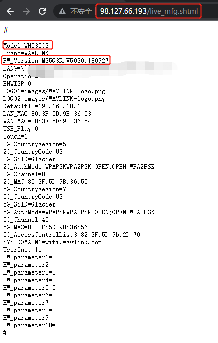

## 0x01 Vulnerability description

A vulnerability is in the 'live_mfg.shtml' page of the WAVLINK WN535 G3,Firmware package version M35G3R.V5030.180927

Unauthorized users can obtain the key information of the router by visiting: 

```
http://xxx.xxx.xxx.xxx/live_mfg.shtml
```

## 0x02 Affected version

```
WAVLINK WN535 G3
```

## 0x03 Vulnerability

Under the live_mfg.shtml file, use the exec cmd function to execute the command

)

## 0x04 PoC verification



## 0x05 	Acknowledgement

Peiwen.Huang
